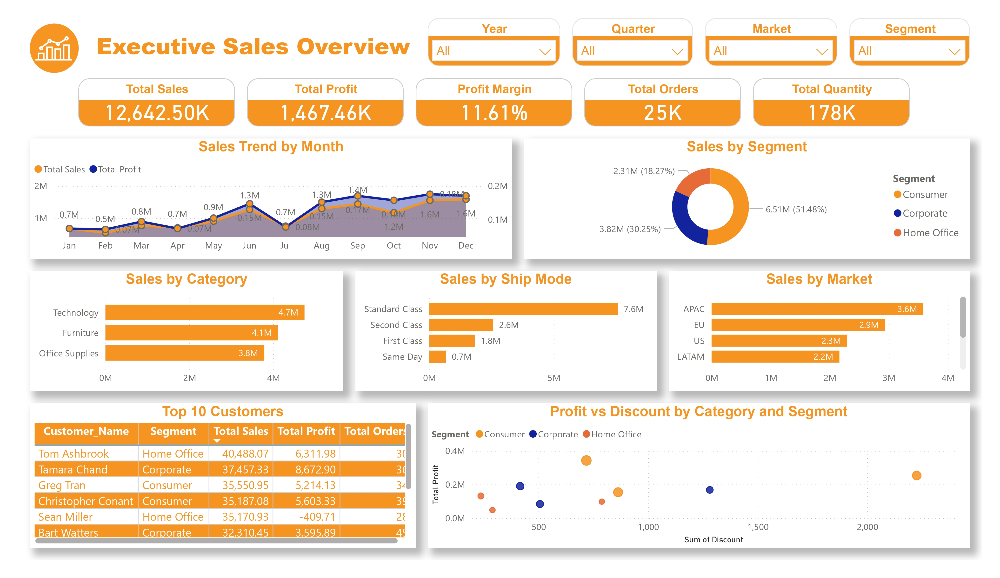
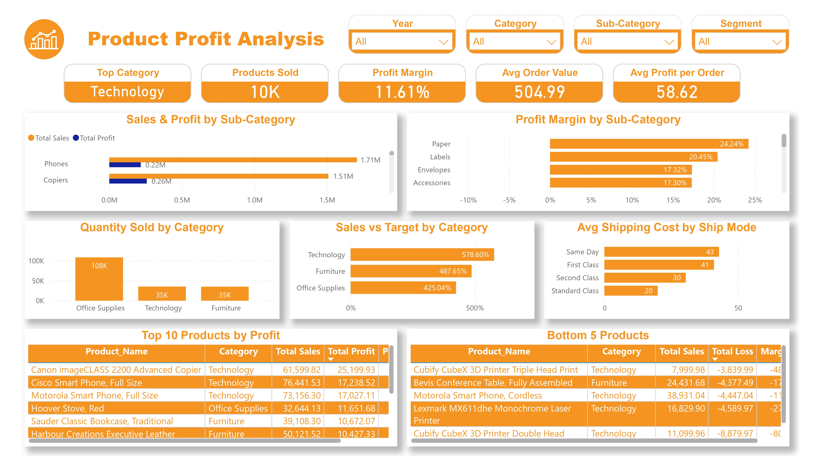
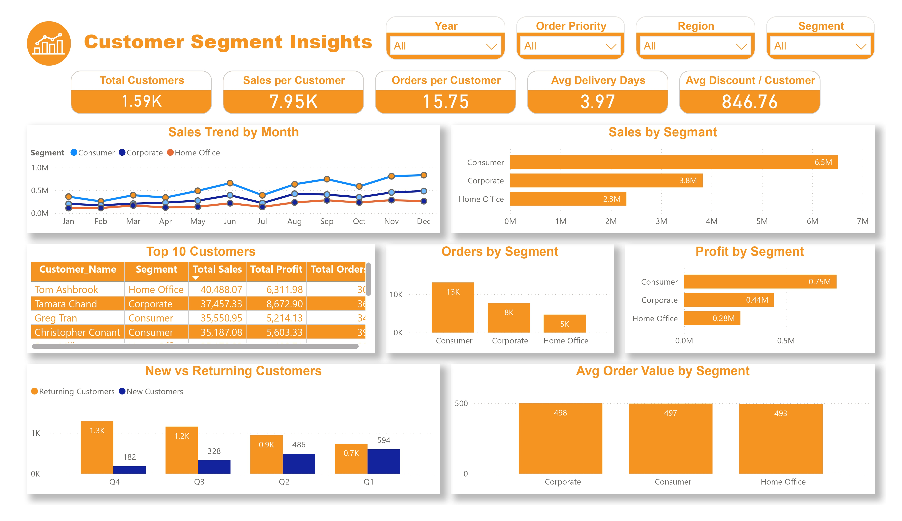
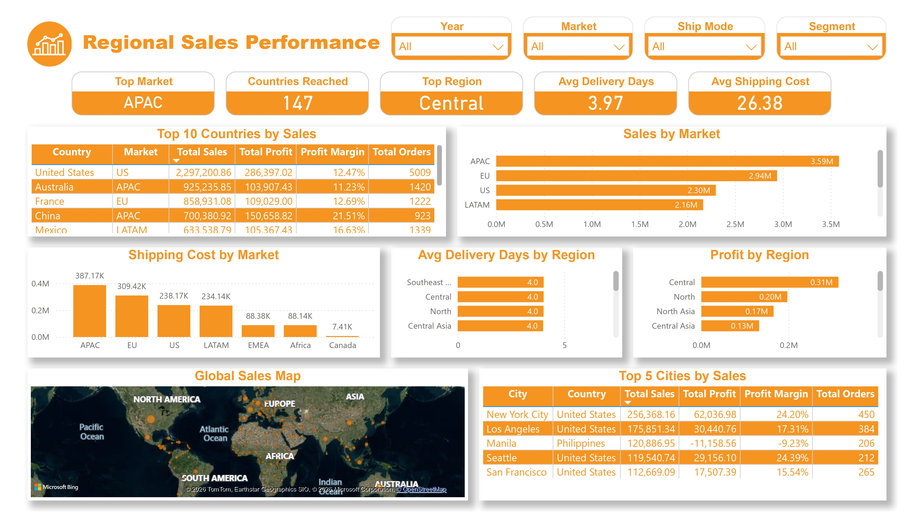

# End-to-End Sales Analytics Dashboard in Power BI & SQL

> A complete data analytics pipeline built on a global retail dataset:
> raw Excel data → Power Query cleaning → SQL analysis → Power BI dashboard with DAX KPIs.

---

## Project overview

This project analyses **$12.64M in global retail sales** across 25,000 orders, 147 countries, and 3 customer segments. The goal was to build a full analytics pipeline — from messy raw data to actionable business insights — using industry-standard tools.

**Pipeline:** Data cleaning → Star schema modelling → DAX measures → Power BI dashboard → SQL analysis

---

## Dashboard pages

### 1. Executive Sales Overview


### 2. Product Profit Analysis


### 3. Customer Segment Insights


### 4. Regional Sales Performance


---

## Key business insights

| # | Insight | Impact |
|---|---------|--------|
| 1 | **5 products generate $25K+ in combined losses** — 4 of 5 are Technology SKUs | Discontinue or reprice immediately — up to 1.5% margin improvement |
| 2 | **China delivers 21.5% profit margin** — nearly double the global average of 11.61% | Expansion here could unlock $2M+ in high-margin revenue |
| 3 | **35% of annual revenue hits in Q4** — heavy seasonal concentration | High risk if supply chain or logistics fail in Oct–Dec |
| 4 | **All 3 customer segments have the same avg order value ($493–498)** | Consumer leads on order frequency (13K vs 5K for Home Office), not ticket size |
| 5 | **Office Supplies has the highest margin (13.2%)** despite being the lowest-revenue category | Lean cost structure — more efficient than Technology (12.8%) or Furniture (9.0%) |
| 6 | **Manila is the only major city generating losses** (-9.23% margin) | Immediate pricing and cost audit required |

---

## Data model (star schema)

```
                    ┌─────────────┐
                    │   SALES     │  ← Fact table
                    │  (fact)     │
                    └──────┬──────┘
           ┌───────────────┼───────────────┐
           ▼               ▼               ▼
   ┌──────────────┐ ┌─────────────┐ ┌────────────────┐
   │   CUSTOMER   │ │   PRODUCT   │ │   GEOGRAPHY    │
   │ (dimension)  │ │ (dimension) │ │  (dimension)   │
   └──────────────┘ └─────────────┘ └────────────────┘
```

| Table | Type | Key columns |
|---|---|---|
| sales | Fact | order_id, customer_id, product_id, geography_key, sales, profit, discount, ship_date |
| customer | Dimension | customer_id, customer_name, segment |
| product | Dimension | product_id, product_name, category, sub_category |
| geography | Dimension | geography_key, city, country, region, market |

---

## SQL analysis

25 queries across 8 business areas. See [`sql/sales_analysis.sql`](sql/sales_analysis.sql).

| Area | Queries | Topics covered |
|---|---|---|
| Business performance | Q1–Q3 | Total revenue, profit, AOV |
| Time-based analysis | Q4–Q6 | Monthly trends, yearly growth, avg delivery time |
| Customer analysis | Q7–Q9 | Top customers, segment revenue, CLV |
| Product analysis | Q10–Q13 | Top/bottom performers, category/sub-category sales |
| Geographical analysis | Q14–Q16 | Region, country, top cities |
| Shipping & operations | Q17–Q19 | Ship mode, avg cost, late deliveries |
| Discount & profit | Q20–Q21 | Discount vs profit, loss-making transactions |
| Advanced analysis | Q22–Q25 | Profit margins, running totals, window functions, CTEs |

**Sample — top product per category using `RANK()` window function:**

```sql
-- Q25: Top product in each category
SELECT * FROM (
    SELECT
        p.category,
        p.product_name,
        SUM(s.sales) AS total_sales,
        RANK() OVER (
            PARTITION BY p.category
            ORDER BY SUM(s.sales) DESC
        ) AS rnk
    FROM sales s
    JOIN product p ON s.product_id = p.product_id
    GROUP BY p.category, p.product_name
) ranked_products
WHERE rnk = 1;
```

**Result:**

| Category | Top product | Sales |
|---|---|---|
| Technology | Cisco Smart Phone, Full Size | $76,441 |
| Furniture | Harbour Creations Executive Leather | $50,121 |
| Office Supplies | Hoover Stove, Red | $32,644 |

---

## Repository structure

```
salesvision-analytics/
│
├── data/
│   ├── customer.xlsx         ← customer dimension
│   ├── geography.xlsx        ← geography dimension
│   ├── product.xlsx          ← product dimension
│   └── sales.xlsx            ← fact table (main dataset)
│
├── sql/
│   └── sales_analysis.sql    ← 25 queries across 8 business areas
│
├── powerbi/
│   └── Sales_Performance_Dashboard.pbix
│
├── assets/
│   ├── dashboard_overview.png
│   ├── dashboard_products.png
│   ├── dashboard_customers.png
│   └── dashboard_regional.png
│
├── docs/
│   └── Sales_Business_Insights_Report.pdf
│
└── README.md
```

---

## Tools used

| Tool | Purpose |
|---|---|
| Microsoft Excel | Raw data storage and initial exploration |
| Power Query | Data cleaning, transformation, data types |
| SQL (PostgreSQL syntax) | 25 business analysis queries |
| DAX | 15+ KPI measures — profit margin, AOV, MoM trends |
| Power BI | 4-page interactive dashboard with drill-through filters |

---

## How to use

1. Open `powerbi/Sales_Performance_Dashboard.pbix` in Power BI Desktop
2. Run `sql/sales_analysis.sql` in any SQL editor (PostgreSQL recommended)
3. Source data files are in the `data/` folder
4. Full insights summary is in `docs/Sales_Business_Insights_Report.pdf`

---

*Prepared by Hanzala Khan*
